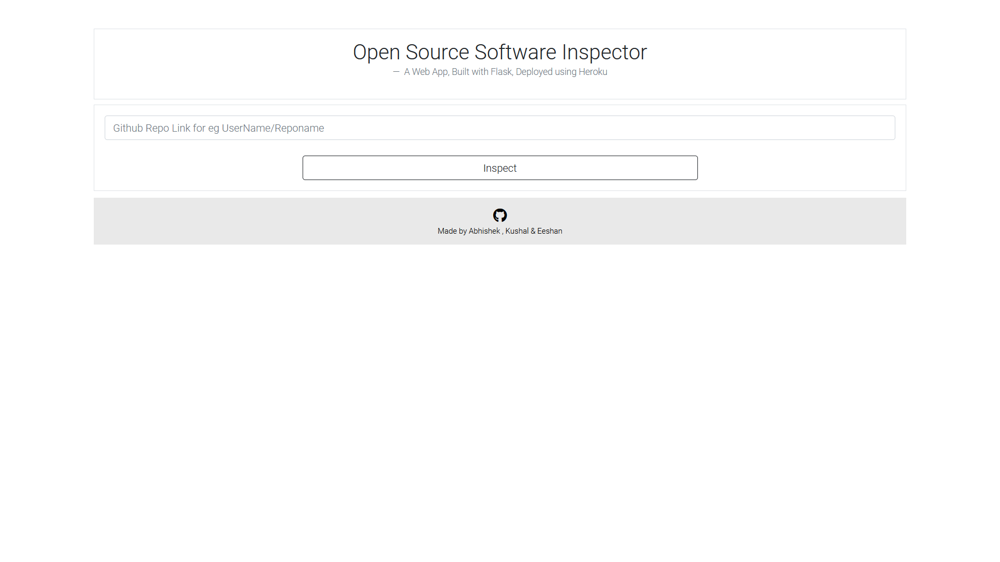
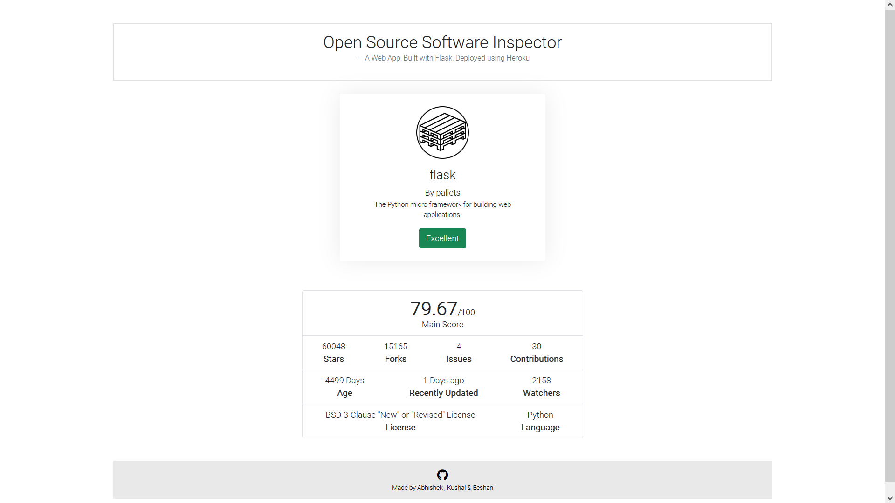
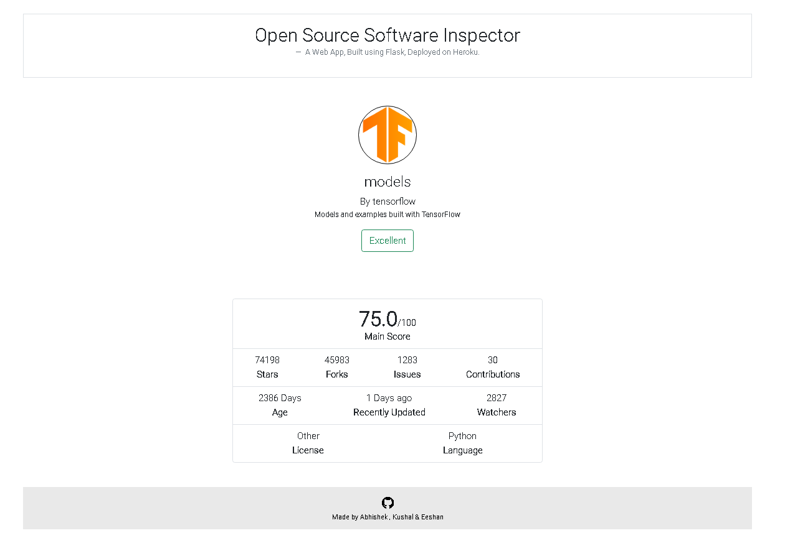

# TrojenHex OSS Inspector for github repository rating

* Open Source Software Inspector Based on Scoring method
* Deployed on Heroku at - https://ossinspector.herokuapp.com/
```
To Run the App: Open terminal : flask run
```
# Sample Screenshots
<table>
  <tr>
    <td>Input Page</td>
  </tr>
 <tr>
 <td></td>
 </tr>
 <tr>
    <td>Output Page</td>
  </tr>
 <tr>
 <td></td>
 </tr>
 <tr>
 <td></td>
 </tr>
</table>

# Contributors
* Eeshan Chanpura
https://github.com/Eeshan2001
* Kushal Jivarajani
https://github.com/Kushaljj
